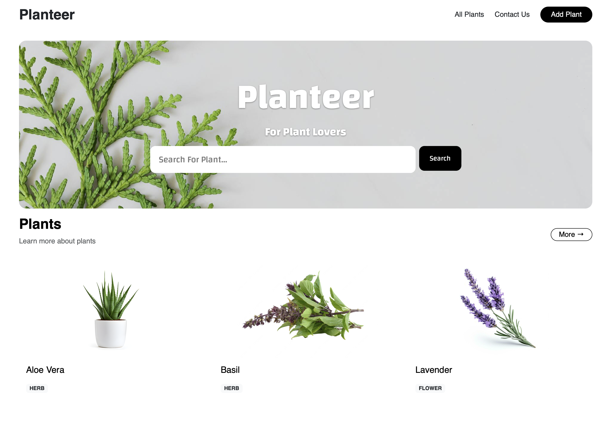
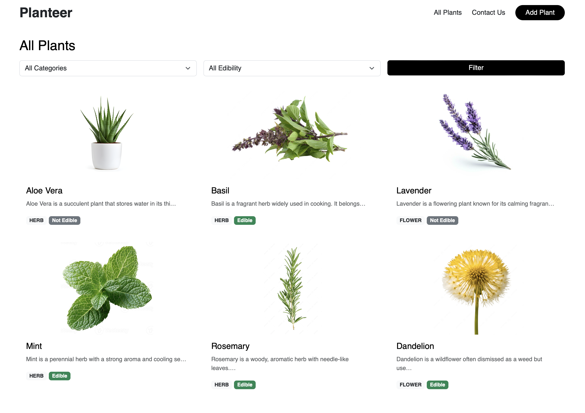
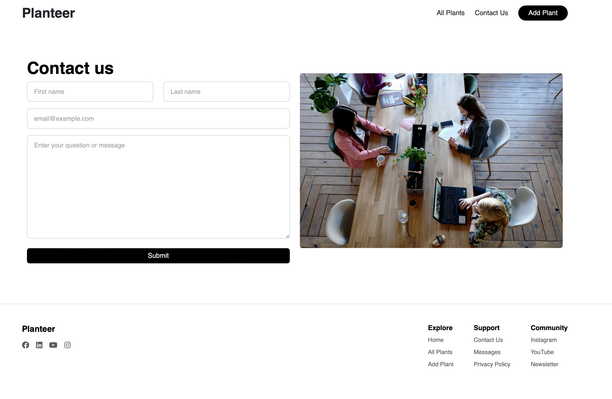

# 🌿 Planteer

**Planteer** is a responsive Django web app for plant lovers to explore, manage, and learn about various plants. Users can browse plant collections, search and filter them, view plant details, and leave comments. There’s also a contact page where users can send messages.

---

## 📸 Screenshots

  

---
  

---

---

## 🚀 Features

- 🏡 Home page with hero section and search
- 🌱 All plants page with filter (by category & edibility)
- 🔍 Search functionality
- 📄 Plant detail page with related plants and comments
- ➕ Add new plant
- ✏️ Update and delete plants with confirmation
- 💬 Add comments to plants
- 📬 Contact Us form
- 📥 Contact message inbox with delete option
- 📱 Fully responsive layout (Bootstrap + custom CSS)

---

## 🧩 Tech Stack

- Python 3.13
- Django 5.x
- SQLite (default)
- HTML5 + CSS3 + Bootstrap
- Pillow (for image uploads)
